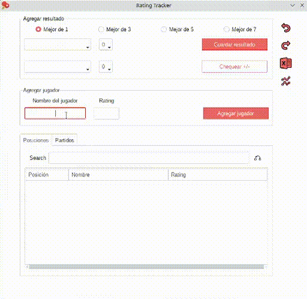

# rating-tracker

- Un programa con interfaz gráfica para trackear ratings de jugadores, contándose con la posibilidad de exportar los datos, manejados con sqlite3, a excel.

## Cómo funciona

| Diferencia rating | Gana mejor jugador | Gana peor jugador |
|:-----------------:|:------------------:|:-----------------:|
|     0-24          |         10         |         10        |
|    25-49          |          9         |         12        |
|    50-99          |          8         |         14        |
|   100-149         |          7         |         16        |
|   150-199         |          6         |         18        |
|   200-299         |          5         |         20        |
|   300-399         |          4         |         22        |
|   400-499         |          3         |         24        |
|   500-749         |          2         |         26        |
|     750+          |          1         |         28        |

- Estos valores se pueden ajustar en el archivo conf.json, con las variables
`rating_deltas`, `points_better_wins` y `points_worse_wins`.
- Estos valores se multiplican dependiendo de la modalidad, según la siguiente
tabla, también pueden ajustarse estos valores en el archivo de configuración,
tocando la variable `multipliers`, se redonde para abajo en caso de resultado no entero.

|  Modalidad | Multiplicador |
|:----------:|:-------------:|
| Mejor de 1 |      0.5      |
| Mejor de 3 |       1       |
| Mejor de 5 |      1.25     |
| Mejor de 7 |      1.5      |

### Ejemplo

- Jugador A (1500) le gana a Jugador B (1300) un partido a mejor de 7
  - Jugador A (1500) -> (1507)
  - Jugador B (1300) -> (1293)
  - 200 de diferencia de rating -> ⌊(+5/-5) * 1.5 = (+7/-7)⌋  
## Dependencies

- pandas
- openpyxl
- ttkbootstrap
